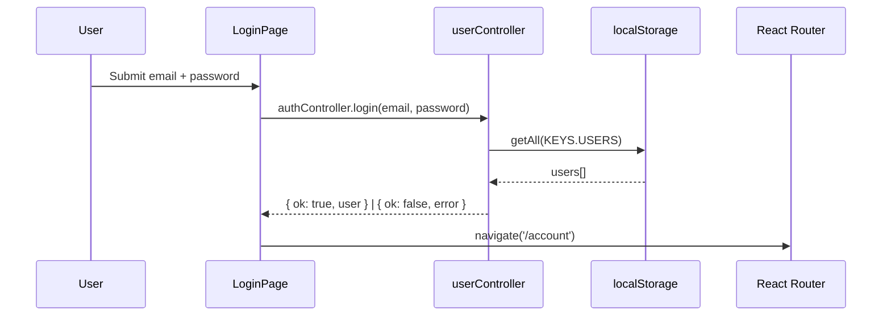
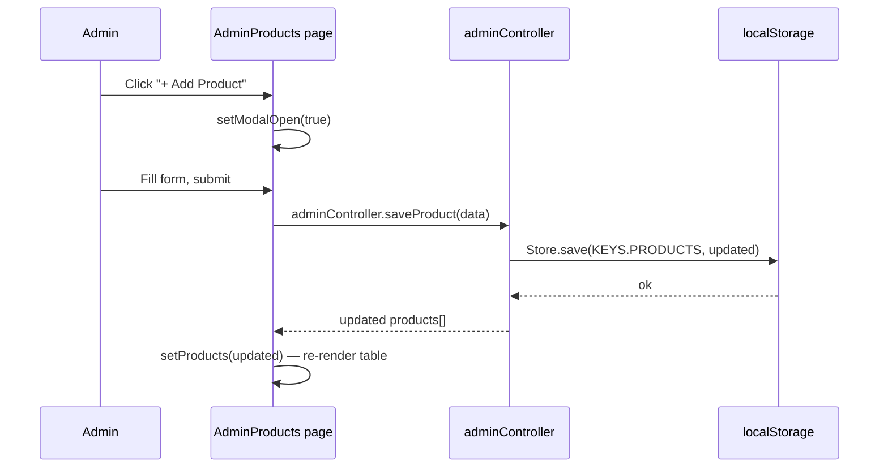
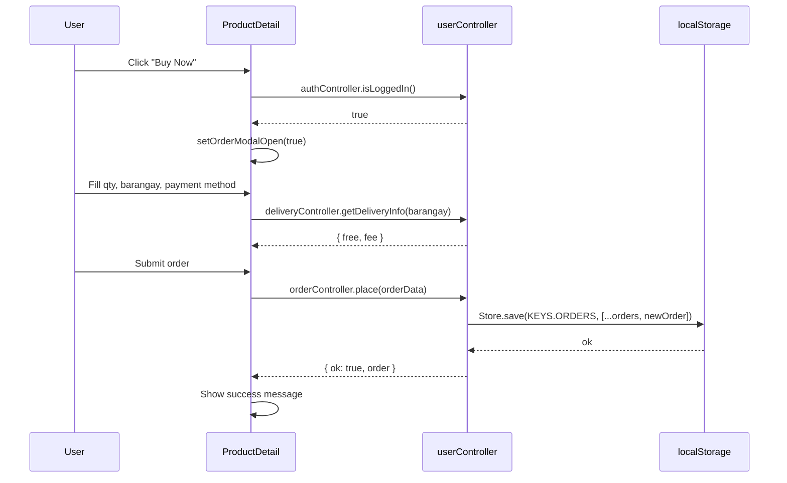

# Design Document: React + Vite Migration — JUDY'S Mini Hardware

## Overview

Migrate the existing multi-page HTML/CSS/JS application for JUDY'S Mini Hardware into a single-page React application (JSX) running inside the existing Vite setup. All CSS files are replaced with Tailwind CSS utility classes. The original design, layout, spacing, responsiveness, and behavior are preserved exactly — only the technology stack changes.

The app has two distinct user roles: **User** (storefront) and **Admin** (management panel). Both are served from the same Vite/React entry point via React Router, with route-level auth guards.

---

## Architecture

```mermaid
graph TD
    A[index.html — Vite entry] --> B[src/main.jsx]
    B --> C[src/App.jsx — Router]

    C --> D[User Routes]
    C --> E[Admin Routes — AdminAuthGuard]

    D --> D1[/ — Home]
    D --> D2[/products — Products]
    D --> D3[/products/:id — ProductDetail]
    D --> D4[/account — Account — AuthGuard]
    D --> D5[/login — Login]
    D --> D6[/register — Register]
    D --> D7[/contact — Contact]
    D --> D8[/about — About]

    E --> E1[/admin/login — AdminLogin]
    E --> E2[/admin — AdminDashboard]
    E --> E3[/admin/products — AdminProducts]
    E --> E4[/admin/categories — AdminCategories]
    E --> E5[/admin/orders — AdminOrders]
    E --> E6[/admin/payments — AdminPayments]
    E --> E7[/admin/inquiries — AdminInquiries]
    E --> E8[/admin/settings — AdminSettings]

    C --> F[src/components/Navbar.jsx]
    C --> G[src/components/Footer.jsx]
    C --> H[src/components/Sidebar.jsx — Admin]

    I[src/controllers/userController.js] --> D
    J[src/controllers/adminController.js] --> E
    K[js/store.js — localStorage] --> I
    K --> J
```

---

## Sequence Diagrams

### User Login Flow



### Admin Product CRUD Flow



### Buy Now / Order Placement Flow



---

## Components and Interfaces

### `src/components/Navbar.jsx`

**Purpose**: Sticky top navigation bar for all user-facing pages. Shows logo, nav links, and auth-aware Sign In / Account button.

**Interface**:
```jsx
// No props — reads auth state from userController internally
function Navbar() { ... }
```

**Responsibilities**:
- Render sticky navbar with `bg-[#004B23]` background
- Show hamburger on mobile (`md:hidden`), full links on desktop
- Toggle mobile menu with `useState`
- Highlight active route with `useLocation`
- Show user's first name + account link when logged in, "Sign In" button when not

---

### `src/components/Footer.jsx`

**Purpose**: Shared footer for all user-facing pages.

**Interface**:
```jsx
function Footer() { ... }
```

**Responsibilities**:
- Render 3-column footer grid (brand, quick links, contact)
- Load `contactInfo` from `Store.getSettings()` via `userController`
- Responsive: stacked on mobile, 3-col on `lg:`

---

### `src/components/Sidebar.jsx`

**Purpose**: Admin panel left sidebar (desktop) and slide-in drawer (mobile).

**Interface**:
```jsx
function Sidebar({ activePage }) { ... }
// activePage: 'dashboard' | 'products' | 'categories' | 'orders' | 'payments' | 'inquiries' | 'settings'
```

**Responsibilities**:
- Render sidebar nav links with active highlight
- Hidden on mobile (`hidden md:block`), replaced by hamburger drawer
- Hamburger button in admin navbar opens drawer overlay on mobile
- Logout link calls `adminController.logout()` then navigates to `/admin/login`

---

### `src/components/AdminLayout.jsx`

**Purpose**: Wrapper layout for all admin pages — combines admin navbar, sidebar, and main content area.

**Interface**:
```jsx
function AdminLayout({ children, activePage }) { ... }
```

**Responsibilities**:
- Render `grid md:grid-cols-[200px_1fr] lg:grid-cols-[240px_1fr]`
- Include `Sidebar` and admin `<nav>` (navbar)
- Wrap `children` in `<main className="bg-gray-100 p-4 md:p-6 lg:p-8">`

---

### `src/components/Modal.jsx`

**Purpose**: Reusable modal overlay used for product/category add-edit forms and order placement.

**Interface**:
```jsx
function Modal({ open, onClose, title, children }) { ... }
```

**Responsibilities**:
- Render fixed overlay with backdrop click to close
- Slide up from bottom on mobile, centered on `sm:` and above
- Trap focus, close on Escape key

---

### `src/components/ProductCard.jsx`

**Purpose**: Reusable product card used on Home and Products pages.

**Interface**:
```jsx
function ProductCard({ product, onBuyNow }) { ... }
// product: { id, name, price, image, available }
// onBuyNow: (product) => void
```

**Responsibilities**:
- Render product image, name, price, availability badge
- "Details" link → `/products/:id`
- "Buy Now" button → calls `onBuyNow(product)`

---

### `src/components/BuyNowModal.jsx`

**Purpose**: Full order placement modal (qty, barangay, delivery preview, payment method, GCash panel, proof upload).

**Interface**:
```jsx
function BuyNowModal({ product, open, onClose }) { ... }
```

**Responsibilities**:
- Mirror the full `buy-now.js` / `product-detail.js` order flow in React
- Use `useState` for form fields, delivery preview, payment method toggle
- Call `orderController.place()` on submit
- Call `paymentController.submit()` for GCash orders
- Show success message after placement

---

## Data Models

### Product
```typescript
interface Product {
  id: string
  name: string
  price: number
  category: string        // category id
  image: string           // URL or base64
  previews?: string[]     // additional image URLs
  description?: string
  specs?: {
    material?: string
    size?: string
    weight?: string
    usage?: string
    brand?: string
    warranty?: string
  }
  available: boolean
}
```

### Category
```typescript
interface Category {
  id: string
  name: string
  icon?: string           // base64 image
}
```

### Order
```typescript
interface Order {
  id: string
  userId: string
  userName: string
  userEmail: string
  productId: string
  productName: string
  productPrice: number
  quantity: number
  barangay: string
  address: string
  deliveryFee: number
  deliveryFree: boolean
  totalPrice: number
  notes: string
  status: 'pending' | 'payment_pending' | 'paid' | 'payment_rejected' | 'confirmed' | 'cancelled'
  createdAt: string       // ISO 8601
}
```

### Payment
```typescript
interface Payment {
  id: string
  orderId: string
  userId: string
  userName: string
  userEmail: string
  productName: string
  amountPaid: number
  paymentMethod: 'cash' | 'gcash'
  proofImage: string | null   // base64
  notes: string
  status: 'pending' | 'approved' | 'rejected'
  createdAt: string
  reviewedAt: string | null
}
```

### User (session)
```typescript
interface UserSession {
  id: string
  name: string
  email: string
  createdAt: string
}
```

### Inquiry
```typescript
interface Inquiry {
  id: string
  name: string
  phone: string
  email: string
  subject: string
  message: string
  read: boolean
  timestamp: string
}
```

### Settings
```typescript
interface Settings {
  businessName: string
  contactInfo: string
  address: string
  hoursWeekday?: string
  hoursSunday?: string
  deliveryFee?: number
  deliveryNote?: string
}
```

---

## Controllers

### `src/controllers/userController.js`

Wraps all user-facing logic. Imports and re-exports the existing `Store`, `Auth`, `Orders`, `Payment`, `Delivery` modules (which are already ES-module-compatible or will be adapted).

```javascript
// Auth
export const authController = {
  register(data),          // { ok, error?, user? }
  login(data),             // { ok, error?, user? }
  logout(),
  currentUser(),           // UserSession | null
  isLoggedIn(),            // boolean
  requireAuth(),           // throws/redirects if not logged in
  updateProfile(data),     // { ok, error?, user? }
}

// Orders
export const orderController = {
  place(data),             // { ok, error?, order? }
  cancel(orderId),         // { ok, error? }
  getByUser(userId),       // Order[]
  statusLabel(status),     // string
  statusColor(status),     // string (hex)
}

// Payment
export const paymentController = {
  submit(data),            // { ok, error?, payment? }
  getByOrder(orderId),     // Payment | null
  getByUser(userId),       // Payment[]
  getGcashConfig(),        // { name, number, qrSrc }
  statusLabel(status),     // string
  statusColor(status),     // string
}

// Delivery
export const deliveryController = {
  getDeliveryInfo(barangay),  // { free, fee, label, barangay }
  getFreeBarangays(),          // string[]
}

// Store / Settings
export const storeController = {
  getSettings(),           // Settings
  getProducts(),           // Product[]
  getCategories(),         // Category[]
}
```

---

### `src/controllers/adminController.js`

Wraps all admin-facing logic.

```javascript
// Admin Auth
export const adminAuthController = {
  login(username, password),  // { ok, error? }
  logout(),
  isLoggedIn(),               // boolean
  requireAuth(),
  currentAdmin(),             // { username } | null
}

// Products CRUD
export const productController = {
  getAll(),                   // Product[]
  save(product),              // saves new or updates existing
  delete(id),                 // removes product
}

// Categories CRUD
export const categoryController = {
  getAll(),                   // Category[]
  save(category),
  delete(id),                 // cascade-clears from products
}

// Orders (admin view)
export const adminOrderController = {
  getAll(),                   // Order[]
  updateStatus(id, status),   // boolean
}

// Payments (admin view)
export const adminPaymentController = {
  getAll(),                   // Payment[]
  review(paymentId, status),  // boolean — 'approved' | 'rejected'
  saveGcashConfig(config),
}

// Inquiries
export const inquiryController = {
  getAll(),                   // Inquiry[]
  markRead(id),
  markUnread(id),
  delete(id),
}

// Settings
export const settingsController = {
  get(),                      // Settings
  save(partial),              // merges and persists
}

// Dashboard metrics
export const dashboardController = {
  getMetrics(),               // { products, categories, availableStock, totalOrders, pendingOrders, unreadMsgs, totalSales }
}
```

---

## Project File Structure

```
src/
├── main.jsx                        # Vite entry — ReactDOM.createRoot
├── App.jsx                         # React Router routes + auth guards
├── index.css                       # Tailwind directives only (@tailwind base/components/utilities)
│
├── controllers/
│   ├── userController.js           # Auth, Orders, Payment, Delivery, Store wrappers
│   └── adminController.js          # AdminAuth, Products, Categories, Orders, Payments, Inquiries, Settings
│
├── components/
│   ├── Navbar.jsx                  # User-facing sticky navbar
│   ├── Footer.jsx                  # User-facing footer
│   ├── Sidebar.jsx                 # Admin sidebar + mobile drawer
│   ├── AdminLayout.jsx             # Admin page wrapper (navbar + sidebar + main)
│   ├── Modal.jsx                   # Reusable modal overlay
│   ├── ProductCard.jsx             # Product card (home + products pages)
│   └── BuyNowModal.jsx             # Full order placement modal
│
└── pages/
    ├── Home.jsx                    # index.html → hero, categories, featured products
    ├── Products.jsx                # products.html → filter sidebar + product grid
    ├── ProductDetail.jsx           # product-detail.html → gallery, specs, order modal
    ├── Account.jsx                 # account.html → orders tab + profile tab
    ├── Login.jsx                   # login.html
    ├── Register.jsx                # register.html
    ├── Contact.jsx                 # contact.html → inquiry form + store info
    ├── About.jsx                   # about.html
    └── admin/
        ├── AdminLogin.jsx          # admin/login.html
        ├── AdminDashboard.jsx      # admin/index.html → metrics + recent orders
        ├── AdminProducts.jsx       # admin/products.html → table + add/edit modal
        ├── AdminCategories.jsx     # admin/categories.html → form + table
        ├── AdminOrders.jsx         # admin/orders.html → filter + table + detail panel
        ├── AdminPayments.jsx       # admin/payments.html → stats + filter + table + lightbox
        ├── AdminInquiries.jsx      # admin/inquiries.html → list + detail panel
        └── AdminSettings.jsx       # admin/settings.html → store info, hours, delivery, GCash, credentials
```

---

## Tailwind Color Mapping

The existing CSS custom properties map to Tailwind as follows. These are added to `tailwind.config.js` under `theme.extend.colors`:

| CSS Variable | Tailwind Token | Hex |
|---|---|---|
| `--deep-forest` | `forest` | `#004B23` |
| `--hardware-green` | `green` | `#008000` |
| `--vibrant-growth` | `growth` | `#38B000` |
| `--text-dark` | `dark` | `#1a1a1a` |
| `--text-muted` | `muted` | `#555555` |
| `--light-gray` | `light` | `#F5F5F5` |

Usage examples:
- `bg-[#004B23]` or `bg-forest` for deep forest backgrounds
- `text-[#008000]` or `text-green` for hardware green text
- `shadow-[0_2px_12px_rgba(0,0,0,0.10)]` for the standard card shadow

---

## Routing

React Router v6 is used. Routes are defined in `App.jsx`:

```jsx
// User routes
<Route path="/" element={<Home />} />
<Route path="/products" element={<Products />} />
<Route path="/products/:id" element={<ProductDetail />} />
<Route path="/login" element={<Login />} />
<Route path="/register" element={<Register />} />
<Route path="/contact" element={<Contact />} />
<Route path="/about" element={<About />} />
<Route path="/account" element={<AuthGuard><Account /></AuthGuard>} />

// Admin routes
<Route path="/admin/login" element={<AdminLogin />} />
<Route path="/admin" element={<AdminAuthGuard><AdminDashboard /></AdminAuthGuard>} />
<Route path="/admin/products" element={<AdminAuthGuard><AdminProducts /></AdminAuthGuard>} />
<Route path="/admin/categories" element={<AdminAuthGuard><AdminCategories /></AdminAuthGuard>} />
<Route path="/admin/orders" element={<AdminAuthGuard><AdminOrders /></AdminAuthGuard>} />
<Route path="/admin/payments" element={<AdminAuthGuard><AdminPayments /></AdminAuthGuard>} />
<Route path="/admin/inquiries" element={<AdminAuthGuard><AdminInquiries /></AdminAuthGuard>} />
<Route path="/admin/settings" element={<AdminAuthGuard><AdminSettings /></AdminAuthGuard>} />
```

`AuthGuard` checks `authController.isLoggedIn()` and redirects to `/login?next=<current>` if false.  
`AdminAuthGuard` checks `adminAuthController.isLoggedIn()` and redirects to `/admin/login` if false.

---

## State Management Strategy

No external state library is needed. Each page manages its own local state with `useState` and `useEffect`. Controllers read/write directly to `localStorage` via the existing `Store` module.

| Concern | Approach |
|---|---|
| Auth session | `sessionStorage` (existing `Auth` module) |
| Products / Categories / Orders / Payments / Inquiries | `localStorage` via `Store` module |
| UI state (modals, filters, tabs) | `useState` per component |
| Route params (product id, category filter) | `useParams`, `useSearchParams` |
| Active route highlight | `useLocation` |

---

## Key React Patterns Per Page

### Home.jsx
- `useEffect` → load categories + featured products from `storeController`
- `useState` for `categories`, `products`, `settings`
- Render `<ProductCard>` components with `onBuyNow` prop
- `<BuyNowModal>` controlled by `useState({ open, product })`

### Products.jsx
- `useSearchParams` to read `?category=` pre-selection
- `useState` for `checkedCategories[]`, `priceMin`, `priceMax`
- Pure filter functions `filterByCategory` and `filterByPrice` (ported from `js/products.js`)
- Sidebar toggle with `useState(sidebarOpen)`

### ProductDetail.jsx
- `useParams` for `:id`
- `useEffect` → load product, category, related products
- `useState` for `mainImage`, `orderModalOpen`
- `<BuyNowModal>` for order placement

### Account.jsx
- `useEffect` → `authController.requireAuth()` redirect
- `useState` for `activeTab` ('orders' | 'profile'), `orders[]`
- Tab switching via `useState` (no DOM manipulation)
- Name/password forms with controlled inputs

### AdminDashboard.jsx
- `useEffect` → `dashboardController.getMetrics()`
- `useState` for `metrics`, `recentOrders[]`

### AdminProducts.jsx
- `useState` for `products[]`, `modalOpen`, `editingProduct`
- `useEffect` → load products + categories on mount
- Form controlled inputs, image file reader via `FileReader` API

### AdminPayments.jsx
- `useState` for `payments[]`, `filter`, `lightboxSrc`, `lightboxOpen`
- Approve/reject calls `adminPaymentController.review()` then re-fetches

### AdminInquiries.jsx
- `useState` for `inquiries[]`, `filter`, `selectedInquiry`
- Two-column layout: list + detail panel

---

## Error Handling

| Scenario | Response |
|---|---|
| User not logged in on `/account` | Redirect to `/login?next=/account` |
| Admin not logged in on `/admin/*` | Redirect to `/admin/login` |
| Product ID not found in URL | Redirect to `/products` |
| Form validation failure | Inline error messages via `useState` |
| `localStorage` read/write error | `Store` module catches and logs; UI shows empty state |
| GCash proof not uploaded | Inline form error, prevent submit |

---

## Testing Strategy

### Unit Testing Approach

Pure controller functions (filter, delivery, auth logic) are unit-testable without DOM. The existing `filterByCategory` and `filterByPrice` functions from `js/products.js` are ported as pure exports from `userController.js` and can be tested directly.

### Property-Based Testing Approach

The existing `tests/properties.html` property tests for `filterByCategory` and `filterByPrice` can be ported to a Vitest + fast-check setup.

**Property Test Library**: fast-check

Key properties to test:
- `filterByCategory(products, []) === products` (empty filter returns all)
- `filterByPrice(products, min, max)` — all results satisfy `price >= min && price <= max`
- `filterByCategory(filterByCategory(products, cats), cats) === filterByCategory(products, cats)` (idempotent)
- `validateInquiry` — any object missing name/phone/message returns false

### Integration Testing Approach

Manual smoke testing per route after migration. Verify:
- All 8 user pages render correctly
- All 8 admin pages render correctly
- Order placement flow end-to-end
- GCash payment submission and admin approval
- Auth guards redirect correctly

---

## Performance Considerations

- Images remain external URLs or base64 (no change from original)
- `loading="lazy"` preserved on product images via JSX `loading` prop
- No unnecessary re-renders: state is kept local to each page component
- `useEffect` dependencies are tightly scoped to avoid infinite loops
- Tailwind's PurgeCSS (content scanning) keeps the CSS bundle minimal

---

## Security Considerations

- Auth is frontend-only (localStorage/sessionStorage) — same as original
- Admin credentials stored in `localStorage` — same as original
- No new attack surface introduced by the migration
- `rel="noopener"` preserved on all external links

---

## Dependencies

| Package | Purpose | Already installed? |
|---|---|---|
| `react` + `react-dom` | UI framework | ✅ |
| `vite` + `@vitejs/plugin-react` | Build tool | ✅ |
| `tailwindcss` + `postcss` + `autoprefixer` | Styling | ✅ |
| `react-router-dom` | Client-side routing | ❌ — needs install |
| Font Awesome 6 | Icons (via CDN in `index.html`) | via CDN |

The only new dependency is `react-router-dom`. All other packages are already present.

---

## Correctness Properties

*A property is a characteristic or behavior that should hold true across all valid executions of a system — essentially, a formal statement about what the system should do. Properties serve as the bridge between human-readable specifications and machine-verifiable correctness guarantees.*

### Property 1: AuthGuard redirects unauthenticated users with next param

*For any* protected user route path, when an unauthenticated user attempts to access it, the AuthGuard SHALL redirect to `/login` and the redirect URL SHALL include a `?next=<original-path>` query parameter.

**Validates: Requirements 2.1, 2.2**

---

### Property 2: AdminAuthGuard redirects unauthenticated admins

*For any* admin route path (excluding `/admin/login`), when an unauthenticated admin attempts to access it, the AdminAuthGuard SHALL redirect to `/admin/login`.

**Validates: Requirements 2.3**

---

### Property 3: Login rejects invalid credentials

*For any* email and password combination that does not match a registered user, `authController.login()` SHALL return `{ ok: false }` and SHALL NOT create a session.

**Validates: Requirements 3.4**

---

### Property 4: Registration creates a retrievable user

*For any* valid registration data (unique email, name, password), `authController.register()` SHALL return `{ ok: true, user }` and the new user SHALL be retrievable in subsequent calls.

**Validates: Requirements 3.1**

---

### Property 5: Logout clears session (round-trip)

*For any* authenticated session, calling `authController.logout()` SHALL result in `authController.isLoggedIn()` returning `false` and `authController.currentUser()` returning `null`.

**Validates: Requirements 3.5, 3.6**

---

### Property 6: filterByCategory with empty list returns all products

*For any* list of products, calling `filterByCategory(products, [])` SHALL return all products unchanged.

**Validates: Requirements 4.1**

---

### Property 7: filterByCategory returns only matching products

*For any* list of products and any non-empty category selection, every product returned by `filterByCategory` SHALL have a `category` field that is included in the selected category list.

**Validates: Requirements 4.2**

---

### Property 8: filterByCategory is idempotent

*For any* list of products and any category selection, applying `filterByCategory` twice with the same selection SHALL produce the same result as applying it once.

**Validates: Requirements 4.3**

---

### Property 9: filterByPrice returns products within bounds

*For any* list of products and any valid price range `[min, max]`, every product returned by `filterByPrice(products, min, max)` SHALL have a price greater than or equal to `min` and less than or equal to `max`.

**Validates: Requirements 4.4**

---

### Property 10: Order placement preserves all required fields

*For any* valid order submission, the order record created by `orderController.place()` SHALL contain all required fields (userId, productId, quantity, barangay, deliveryFee, totalPrice, status, createdAt) with values matching the submitted data.

**Validates: Requirements 5.1**

---

### Property 11: getByUser returns only that user's orders

*For any* userId, every order returned by `orderController.getByUser(userId)` SHALL have a `userId` field equal to the provided value.

**Validates: Requirements 5.2**

---

### Property 12: Free barangays receive free delivery

*For any* barangay in the free delivery list, `deliveryController.getDeliveryInfo(barangay)` SHALL return `{ free: true, fee: 0 }`.

**Validates: Requirements 6.1**

---

### Property 13: Non-free barangays receive a positive delivery fee

*For any* barangay not in the free delivery list, `deliveryController.getDeliveryInfo(barangay)` SHALL return `{ free: false, fee }` where `fee` is a positive number.

**Validates: Requirements 6.2**

---

### Property 14: Payment submission round-trip

*For any* valid payment data submitted via `paymentController.submit()`, calling `paymentController.getByOrder(orderId)` SHALL return a payment record whose fields match the submitted data.

**Validates: Requirements 7.1, 7.2**

---

### Property 15: Product save creates retrievable product

*For any* valid new product object (no existing id), calling `productController.save(product)` SHALL result in the product appearing in the next call to `productController.getAll()`.

**Validates: Requirements 8.1**

---

### Property 16: Product delete removes product

*For any* existing product id, calling `productController.delete(id)` SHALL result in no product with that id appearing in the next call to `productController.getAll()`.

**Validates: Requirements 8.3**

---

### Property 17: Category delete cascades to products

*For any* category id that is deleted, every product that previously referenced that category SHALL have its `category` field cleared in the next call to `productController.getAll()`.

**Validates: Requirements 9.4**

---

### Property 18: Order status update is reflected

*For any* existing order id and valid status value, calling `adminOrderController.updateStatus(id, status)` SHALL result in the order having the new status value in the next call to `adminOrderController.getAll()`.

**Validates: Requirements 10.2**

---

### Property 19: Inquiry markRead / markUnread round-trip

*For any* inquiry, calling `inquiryController.markRead(id)` followed by `inquiryController.markUnread(id)` SHALL restore the inquiry's `read` field to `false`.

**Validates: Requirements 12.2, 12.3**

---

### Property 20: Settings save merges without data loss

*For any* existing settings object and any partial update, calling `settingsController.save(partial)` SHALL update only the provided fields and SHALL preserve all other fields unchanged in the next call to `settingsController.get()`.

**Validates: Requirements 13.1, 13.2**

---

### Property 21: Dashboard metrics reflect current data

*For any* state of the product and order stores, `dashboardController.getMetrics()` SHALL return a `products` count equal to the length of `productController.getAll()` and a `pendingOrders` count equal to the number of orders with status `'pending'` in `adminOrderController.getAll()`.

**Validates: Requirements 14.1, 14.2, 14.3**

---

### Property 22: ProductCard renders all required fields

*For any* product object, the rendered ProductCard SHALL display the product's name, price, and availability status.

**Validates: Requirements 18.1**

---

### Property 23: getByUser returns only that user's payments

*For any* userId, every payment returned by `paymentController.getByUser(userId)` SHALL have a `userId` field equal to the provided value.

**Validates: Requirements 7.5**
